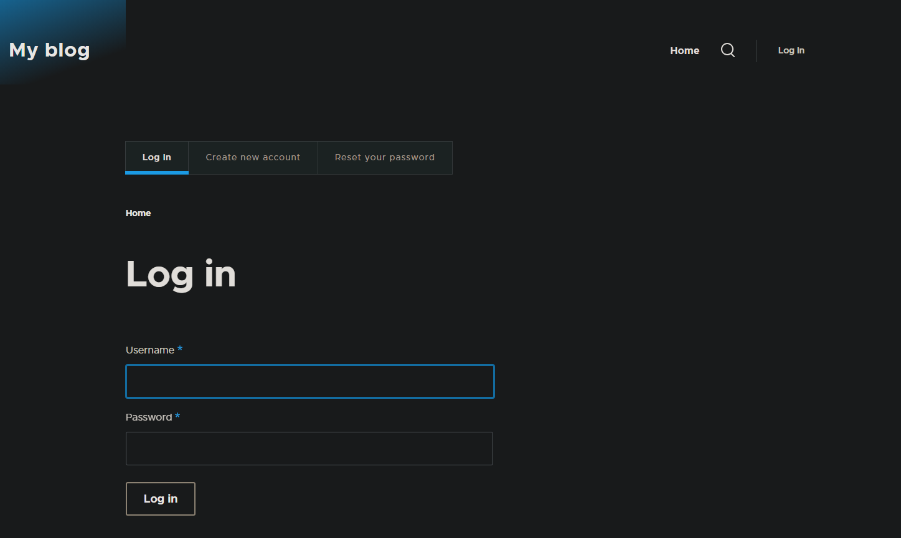

# Task 002 - Configure Auto Scaling


* Follow the instructions in the tutorial [Getting started with Amazon EC2 Auto Scaling](https://docs.aws.amazon.com/autoscaling/ec2/userguide/GettingStartedTutorial.html) to create a launch template.

* [CLI Documentation](https://docs.aws.amazon.com/cli/latest/reference/autoscaling/)

## Pre-requisites

* Networks (RTE-TABLE/SECURITY GROUP) set as at the end of the Labo2.
* 1 AMI of your Drupal instance
* 0 existing ec2 (even is in stopped state)
* 1 RDS Database instance - started
* 1 Elastic Load Balancer - started

## Create a new launch configuration. 

|Key|Value|
|:--|:--|
|Name|LT-DEVOPSTEAM[XX]|
|Version|v1.0.0|
|Tag|Name->same as template's name|
|AMI|Your Drupal AMI|
|Instance type|t3.micro (as usual)|
|Subnet|Your subnet A|
|Security groups|Your Drupal Security Group|
|IP Address assignation|Do not assign|
|Storage|Only 10 Go Storage (based on your AMI)|
|Advanced Details/EC2 Detailed Cloud Watch|enable|
|Purchase option/Request Spot instance|disable|

```
[INPUT]
aws ec2 create-launch-template `
    --launch-template-name LT-DEVOPSTEAM14 `
    --version-description v1.0.0 `
    --tag-specifications 'ResourceType=launch-template,Tags=[{Key=Name,Value=LT-DEVOPSTEAM14}]' `
    --launch-template-data '{
        \"ImageId\": \"ami-04cd5fb0c47a7ce90\",
        \"InstanceType\": \"t3.micro\",
        \"NetworkInterfaces\": [
            {
                \"AssociatePublicIpAddress\": false,
                \"DeviceIndex\": 0,
                \"SubnetId\": \"subnet-03f814992c543a1f8\",
                \"Groups\": [\"sg-0021f9c1f6d3ada16\"]
            }
        ],
        \"BlockDeviceMappings\": [
            {
                \"DeviceName\": \"/dev/xvda\",
                \"Ebs\": {
                    \"VolumeSize\": 10,
                    \"VolumeType\": \"gp3\"
                }
            }
        ],
        \"Monitoring\": {
            \"Enabled\": true
        }
    }'

[OUTPUT]
{
    "LaunchTemplate": {
        "LaunchTemplateId": "lt-07b8266627fc6f417",
        "LaunchTemplateName": "LT-DEVOPSTEAM14",
        "CreateTime": "2024-04-11T13:41:30+00:00",
        "CreatedBy": "arn:aws:iam::709024702237:user/CLD_DEVOPSTEAM14",
        "DefaultVersionNumber": 1,
        "LatestVersionNumber": 1,
        "Tags": [
            {
                "Key": "Name",
                "Value": "LT-DEVOPSTEAM14"
            }
        ]
    }
}
```

## Create an auto scaling group

* Choose launch template or configuration

|Specifications|Key|Value|
|:--|:--|:--|
|Launch Configuration|Name|ASGRP_DEVOPSTEAM[XX]|
||Launch configuration|Your launch configuration|
|Instance launch option|VPC|Refer to infra schema|
||AZ and subnet|AZs and subnets a + b|
|Advanced options|Attach to an existing LB|Your ELB|
||Target group|Your target group|
|Health check|Load balancing health check|Turn on|
||health check grace period|10 seconds|
|Additional settings|Group metrics collection within Cloud Watch|Enable|
||Health check grace period|10 seconds|
|Group size and scaling option|Desired capacity|1|
||Min desired capacity|1|
||Max desired capacity|4|
||Policies|Target tracking scaling policy|
||Target tracking scaling policy Name|TTP_DEVOPSTEAM[XX]|
||Metric type|Average CPU utilization|
||Target value|50|
||Instance warmup|30 seconds|
||Instance maintenance policy|None|
||Instance scale-in protection|None|
||Notification|None|
|Add tag to instance|Name|AUTO_EC2_PRIVATE_DRUPAL_DEVOPSTEAM[XX]|

```
[INPUT]
aws autoscaling create-auto-scaling-group `
    --auto-scaling-group-name ASGRP_DEVOPSTEAM14 `
    --launch-template "LaunchTemplateName=LT-DEVOPSTEAM14,Version=1" `
    --vpc-zone-identifier "subnet-03f814992c543a1f8,subnet-08532e833f35bd94d" `
    --min-size 1 `
    --max-size 4 `
    --desired-capacity 1 `
    --target-group-arns arn:aws:elasticloadbalancing:eu-west-3:709024702237:targetgroup/TG-DEVOPSTEAM14/51f38f269fe06e8a `
    --health-check-type ELB `
    --health-check-grace-period 10 `
    --tags Key=Name,Value=AUTO_EC2_PRIVATE_DRUPAL_DEVOPSTEAM14 `
    --termination-policies "Default" `
	--default-instance-warmup 30 
[OUTPUT]
no output
```

* Result expected

The first instance is launched automatically.

Test ssh and web access.

```
[INPUT]
ssh devopsteam14@15.188.43.46 -i CLD_KEY_DMZ_DEVOPSTEAM14.pem -L 80:internal-ELB-DEVOPSTEAM14-207886138.eu-west-3.elb.amazonaws.com:8080

[OUTPUT]
Linux ip-10-0-0-5 6.1.0-18-cloud-amd64 #1 SMP PREEMPT_DYNAMIC Debian 6.1.76-1 (2024-02-01) x86_64

The programs included with the Debian GNU/Linux system are free software;
the exact distribution terms for each program are described in the
individual files in /usr/share/doc/*/copyright.

Debian GNU/Linux comes with ABSOLUTELY NO WARRANTY, to the extent
permitted by applicable law.
Last login: Thu Apr 11 14:34:45 2024 from 185.144.39.44
devopsteam14@ip-10-0-0-5:~$
```

```
//screen shot, web access (login)
```
