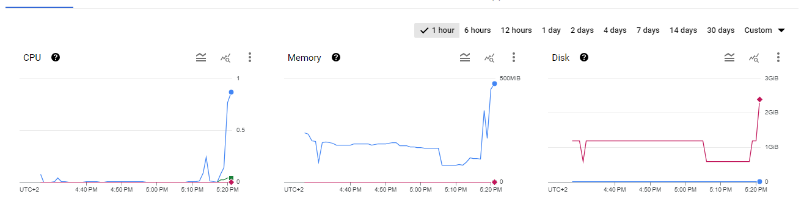

# Task 3 - Add and exercise resilience

By now you should have understood the general principle of configuring, running and accessing applications in Kubernetes. However, the above application has no support for resilience. If a container (resp. Pod) dies, it stops working. Next, we add some resilience to the application.

## Subtask 3.1 - Add Deployments

In this task you will create Deployments that will spawn Replica Sets as health-management components.

Converting a Pod to be managed by a Deployment is quite simple.

  * Have a look at an example of a Deployment described here: <https://kubernetes.io/docs/concepts/workloads/controllers/deployment/>

  * Create Deployment versions of your application configurations (e.g. `redis-deploy.yaml` instead of `redis-pod.yaml`) and modify/extend them to contain the required Deployment parameters.

  * Again, be careful with the YAML indentation!

  * Make sure to have always 2 instances of the API and Frontend running. 

  * Use only 1 instance for the Redis-Server. Why?

    > Redis is a service that is used to store data. If we have multiple instances of Redis, we would have to synchronize the data between them. This is a complex task and is not necessary for this lab. Therefore, we only have one instance of Redis.

  * Delete all application Pods (using `kubectl delete pod ...`) and replace them with deployment versions.

  * Verify that the application is still working and the Replica Sets are in place. (`kubectl get all`, `kubectl get pods`, `kubectl describe ...`)

## Subtask 3.2 - Verify the functionality of the Replica Sets

In this subtask you will intentionally kill (delete) Pods and verify that the application keeps working and the Replica Set is doing its task.

Hint: You can monitor the status of a resource by adding the `--watch` option to the `get` command. To watch a single resource:

```sh
$ kubectl get <resource-name> --watch
```

To watch all resources of a certain type, for example all Pods:

```sh
$ kubectl get pods --watch
```

You may also use `kubectl get all` repeatedly to see a list of all resources.  You should also verify if the application stays available by continuously reloading your browser window.

  * What happens if you delete a Frontend or API Pod? How long does it take for the system to react?
    > a new one is created very quickly, before the deletion is finished
    
  * What happens when you delete the Redis Pod?

    > the same thing
    
  * How can you change the number of instances temporarily to 3? Hint: look for scaling in the deployment documentation

    > `kubectl scale deployment/frontend-deployment --replicas=1`
    
  * What autoscaling features are available? Which metrics are used?

    > proportional scaling is available. cpu percent is used as a metric.
    
  * How can you update a component? (see "Updating a Deployment" in the deployment documentation)

    > using the `kubectl set image` command

## Subtask 3.3 - Put autoscaling in place and load-test it

On the GKE cluster deploy autoscaling on the Frontend with a target CPU utilization of 30% and number of replicas between 1 and 4. 

Load-test using Vegeta (500 requests should be enough).

> [!NOTE]
>
> - The autoscale may take a while to trigger.
>
> - If your autoscaling fails to get the cpu utilization metrics, run the following command
>
>   - ```sh
>     $ kubectl apply -f https://github.com/kubernetes-sigs/metrics-server/releases/latest/download/components.yaml
>     ```
>
>   - Then add the *resources* part in the *container part* in your `frontend-deploy` :
>
>   - ```yaml
>     spec:
>       containers:
>         - ...:
>           env:
>             - ...:
>           resources:
>             requests:
>               cpu: 10m
>     ```
>

## Deliverables

Document your observations in the lab report. Document any difficulties you faced and how you overcame them. Copy the object descriptions into the lab report.

> We did not face any difficulties in this task. 

Autoscaling results:

```sh
$ kubectl autoscale deployment/frontend-deployment --min=1 --max=4 --cpu-percent=30
```

```sh
NAME                                   READY   STATUS    RESTARTS      AGE
api-deployment-664fbdf7d9-vkw7h        1/1     Running   3 (50m ago)   50m
api-deployment-664fbdf7d9-vrnfg        1/1     Running   3 (50m ago)   50m
frontend-deployment-859d5f8544-62n8l   1/1     Running   0             54s
frontend-deployment-859d5f8544-9xgch   1/1     Running   0             79s
redis-56fb88dd96-dnx7r                 1/1     Running   0             47m
<-- Vegeta starts Here
frontend-deployment-859d5f8544-dbmt8   0/1     Pending   0             0s
frontend-deployment-859d5f8544-dbmt8   0/1     Pending   0             0s
frontend-deployment-859d5f8544-4ttcq   0/1     Pending   0             0s
frontend-deployment-859d5f8544-4ttcq   0/1     Pending   0             0s 
frontend-deployment-859d5f8544-dbmt8   0/1     ContainerCreating   0             0s
frontend-deployment-859d5f8544-4ttcq   0/1     ContainerCreating   0             0s
frontend-deployment-859d5f8544-4ttcq   1/1     Running             0             2s
frontend-deployment-859d5f8544-dbmt8   1/1     Running             0             3s
```
google cloud console:



[redis-deploy.yaml](files/redis-deploy.yaml)

[api-deploy.yaml](files/api-deploy.yaml)

[frontend-deploy.yaml](files/frontend-deploy.yaml)